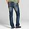
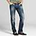

cloudzoomgesture
================

A hack of cloudzoom (http://www.professorcloud.com/mainsite/cloud-zoom.htm) to allow gesture controls.

IMPORTANT!
Only works through server - not through file:///

Desktop:
Hover to zoom.

Mobile:
Double tap to zoom.

HTML Structure:

	

	
	
	

CSS dependancy: cloud-zoom.css
<link rel="stylesheet" type="text/css" href="../assets/cloud-zoom.css" >

JavaScript dependancy: jquery, hammer.js, jquery.hammer.js, cloudzoom.js

